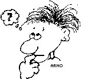

Jesus Christus spricht: "Ich bin das Brot des Lebens. Wer zu mir kommt, den wird nicht hungern;  
und wer an mich glaubt, den wird nimmermehr dürsten." Joh.6,35

Distanz und Nähe [....mehr dazu hier](Naehe-Dis.php)

[Impulse](impulse.php)

                                                                               
Heute schon [nachgedacht?](https://www.lebenistmehr.de/leben-ist-mehr.html)
                                                                               

 

18.03.2022
