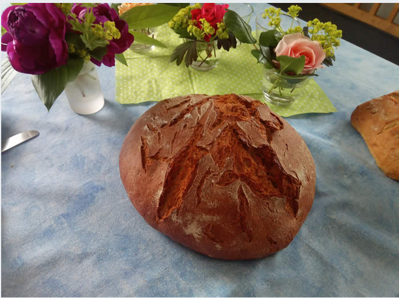

## Herzlich willkommen auf unserer Seite:

## "echtes-Leben-finden"

Jesus Christus spricht: "Ich bin das Brot des Lebens. Wer zu mir kommt, den wird nicht hungern;  
                                       und wer an mich glaubt, den wird nimmermehr dürsten."      Joh.6,35
                                       
                                       

       
              
       
   
  
### Distanz und Nähe
Ein kleiner Junge fragte seinen Vater: »Wie groß ist Gott?« Der Vater antwortete erst mal nicht, 
richtete den Blick zum Himmel, sah ein Flugzeug und fragte seinen Sohn: »Wie groß ist dieses Flugzeug?« 
Der Kleine antwortete, ohne zu zögern: »Sehr klein, Papa, kaum zu sehen!« 
Einige Wochen später besuchte er mit seinen Sohn den Frankfurter Flughafen. 
Während sie auf der Besucherterrasse die geparkten Flugzeuge anschauten, näherte sich ein Airbus A380. 
Da fragte der Vater seinen Sohn: »Erinnerst du Dich noch, an das kleine Flugzeug? Wie groß ist es jetzt?« 
Fasziniert antwortete der Kleine: »Es ist riesig, Papa, man könnte es nie übersehen!« 
Daraufhin sagte der Vater: »So ist es auch mit Gott! 
Seine Größe ist abhängig von dem Abstand, den du zu ihm hältst. 
Je näher du ihm bist, desto größer wird Gott in deinem Leben!« 

[Impulse](impulse.php)

                                                                               Heute schon [nachgedacht?](https://www.lebenistmehr.de/leben-ist-mehr.html)
                                                                               
 
 
 

18.02.2022