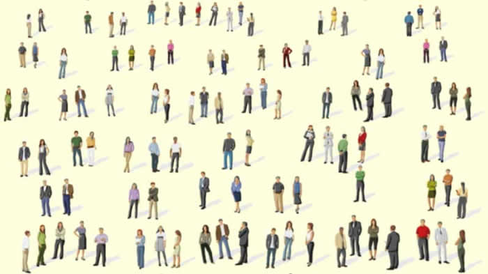
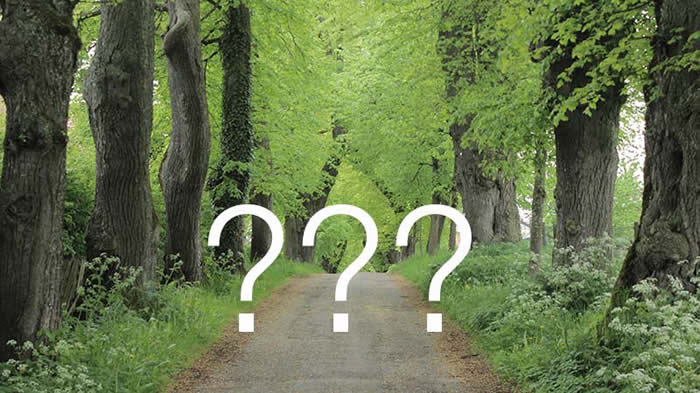

## Über uns:
Der Glaube an Jesus Christus, den Sohn Gottes, und die Bibel verbindet uns.

#### Wer wir sind:

Wir sind Menschen aus Marktoberdorf und Umgebung mit unterschiedlichen Hintergründen und Altersstufen –
was uns verbindet ist der Glaube an Jesus Christus.

Wir sind keine neue religiöse Bewegung, keine christliche Sondergruppe mit Sonderlehren und betrachten uns auch nicht als die einzigste Gemeinde in Marktoberdorf.
Wir sehen uns mit allen anderen Christen verbunden, die durch ihre persönliche Entscheidung Jesus Christus als ihren Herrn und Heiland angenommen haben.
Sämtliche finanzielle Aufwendungen werden durch freiwillige Spenden der Gemeindemitglieder gedeckt.
Wir gehören zu den sogenannten Freikirchen und sind unabhängig von staatlichen oder religiösen Organisationen.

Alle Aufgaben werden ehrenamtlich wahrgenommen.

#### Was wir bewirken möchten:

Unsere gemeinschaftliche Aufgabe ist es, den christlichen Glauben, so wie ihn die Bibel vermittelt, bekannt zu machen und zu fördern.

Dies möchten wir zum Einen in unserem Umfeld und zum Anderen auch durch die Unterstützung von Christen an anderen Orten verwirklichen.

#### Was wir glauben:

Dass die Bibel (Altes und Neues Testament), das unverfälschte geschriebene Wort Gottes ist, und uns als unser Maßstab in allen Glaubens- und Alltagsfragen dient.

Alle Menschen sind sündig vor Gott und gehen ohne seine Rettung in Ewigkeit verloren.
Jesus Christus, Gottes Sohn, ist stellvertretend für unsere Schuld gestorben, und allein Er kann unsere Sünden vergeben.
Jeder Mensch der dies glaubt und für sich persönlich in Anspruch nimmt, hat ewiges Leben in Gottes Herrlichkeit.
Der Heilige Geist lebt in allen Gläubigen und hilft ihnen, in der verbindlichen Nachfolge.

#### Sie sind herzlich willkommen!
Wir freuen uns, wenn Sie uns in einem unserer Gottesdienste besuchen.

Für Kinder bis 12 Jahre werden parallel zur Predigt Inhalte aus der Bibel altersgerecht erzählt.
Außerdem laden wir Sie ein, an Gebets- und Bibelabenden teilzunehmen, die regelmäßig während der Woche stattfinden.
Dabei geht es um Vertiefung des Glaubens durch Gebet, lesen im Wort Gottes und in Gesprächen.

Wir freuen uns über jedes Gemeindeglied das im Rahmen seiner Begabung, Kraft und Möglichkeiten unser Gemeindeleben bereichert.

#### Was ist eine Freikirche?

Freikirchen sind in dem überwiegend katholisch geprägten Allgäu eher unbekannt.
Deshalb geben wir hier eine kurze Erklärung.

Das evangelische Gemeindelexikon, Brockhaus-Verlag, schreibt über Freikirchen:

> „Freikirchen sind seit der Reformation aus dem Gegensatz zu Staats- oder Landeskirchen entstanden. …
 Oft als Sekten bezeichnet, sind sie jedoch in eben dem Maße wie die Kirchen von den Sekten zu unterscheiden. …
 … Sie stellen keinen Ausschließlichkeitsanspruch, sondern ziehen die Vielfalt kirchlicher Organisationsformen vor und wissen darum,
dass Kinder Gottes in allen Kirchen zu finden sind. …“

